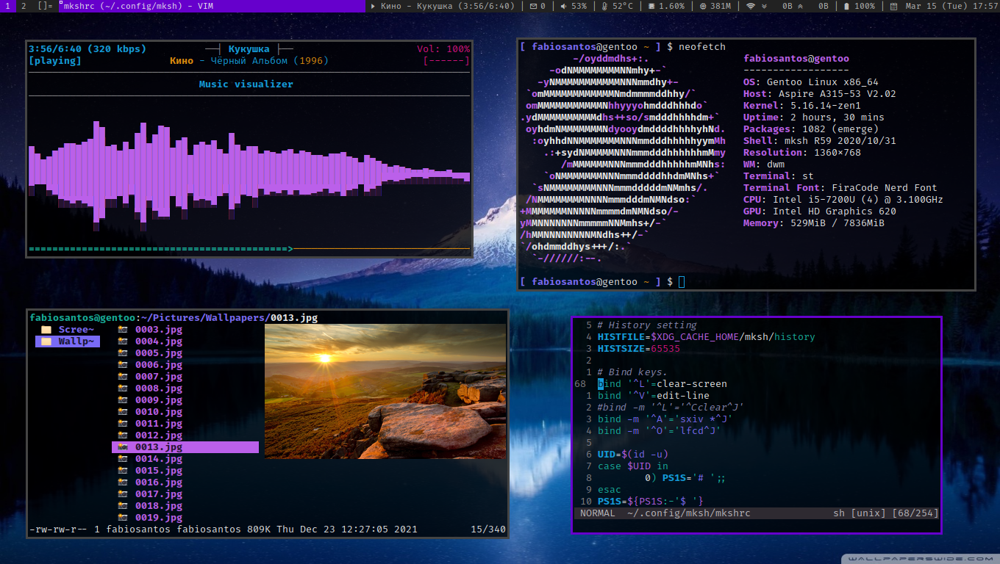

# dwm - dynamic window manager (my custom build)
dwm is an extremely fast, small, and dynamic window manager for X.

## Patches applied

+ dwm-hide_vacant_tags
+ dwm-fixborders
+ dwm-fullgaps
+ dwm-cool-autostart - only for start my dwmstatus script (see my [dotfiles](https://github.com/fabioesantos/Dotfiles))
+ dwm-noborderfloatingfix

