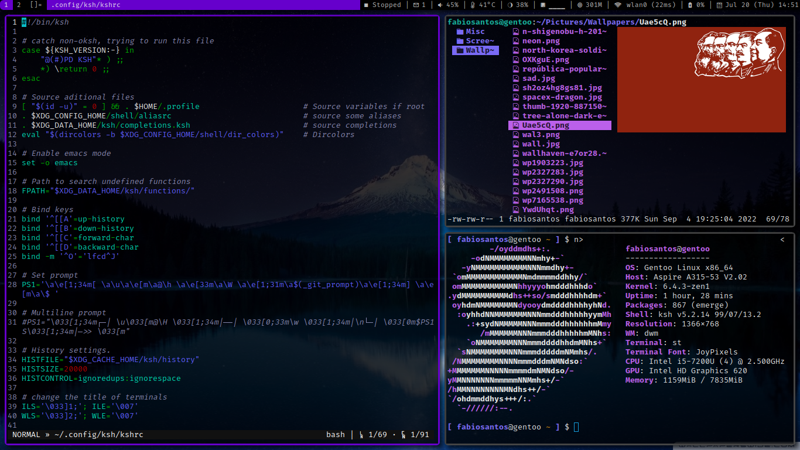

# dwm - dynamic window manager (my custom build)
dwm is an extremely fast, small, and dynamic window manager for X.

If you want to see my scripts and [dotfiles](https://github.com/fabioesantos/Dotfiles).

## Patches applied

+ dwm-hide_vacant_tags
+ dwm-fixborders
+ dwm-fullgaps
+ dwm-statuscmd - for clickable statusbar (I use [dwmblocks-async](https://github.com/UtkarshVerma/dwmblocks-async))

## Installation

Edit config.mk to match your local setup (dwm is installed into
the /usr/local namespace by default).

Afterwards enter the following command to build and install dwm (if
necessary as root):

    make clean install

## Running dwm

Add the following line to your .xinitrc to start dwm using startx:

    exec dwm

## Configuration

The configuration of dwm is done by creating a custom config.h
and (re)compiling the source code.

